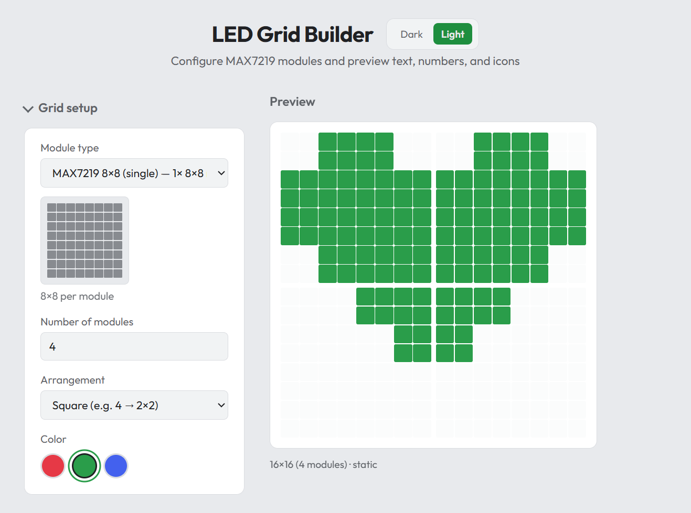

# LED Grid Builder

A small web app to visually build and preview LED grids made from MAX7219 modules. Configure module type, color, then show text, numbers, or standard icons with static, blinking, or scrolling display.

**Documentation:** See the [docs](docs/README.md) folder for an overview of what the app does and a [user guide](docs/user-guide.md).



## Run locally

```bash
npm install
npm run dev
```

Open the URL shown in the terminal (e.g. http://localhost:5173).

## Features

- **Module types**: MAX7219 32×32 (4×4 of 8×8), MAX7219 4-module (32×8)
- **Colors**: Red, Green, Blue
- **Content**: Text/numbers (5×7 font) or icons (radiation, biohazard, skull, heart, smile, warning, check, cross)
- **Display**: Static, Blinking, Floating (horizontal scroll)

## Build

```bash
npm run build
```

Output is in `dist/`.

## Deploy to nginx

1. **Build** the app:
   ```bash
   npm run build
   ```

2. **Copy** the contents of `dist/` to your server (e.g. `/var/www/led-grid-builder`):
   ```bash
   scp -r dist/* user@server:/var/www/led-grid-builder/
   ```

3. **Configure nginx** using `nginx.conf.example` as a reference:
   - Set `root` to the directory where you copied the files.
   - Reload nginx: `sudo nginx -s reload`.

If you serve the app from a **subpath** (e.g. `https://example.com/led-grid-builder/`), set `base: '/led-grid-builder/'` in `vite.config.js` (or use `VITE_BASE_PATH` when building), then rebuild.

## Deploy to GitHub Pages

1. **Enable GitHub Pages** in the repo: **Settings → Pages → Build and deployment → Source**: choose **GitHub Actions**.

2. **Push the repo** (including `.github/workflows/deploy-pages.yml`). Pushes to `main` will build and deploy. The app will be at:
   ```
   https://<username>.github.io/<repository-name>/
   ```
   (e.g. `https://myuser.github.io/led-grid-builder/`)

3. **Optional:** To build locally for the same base path (e.g. to test):
   ```bash
   VITE_BASE_PATH=/led-grid-builder/ npm run build
   ```

## SEO, GEO & llms.txt

- **SEO**: `index.html` includes meta description, keywords, Open Graph and Twitter Card tags, a canonical URL, and JSON-LD `WebApplication` schema. For GitHub Pages the workflow replaces `__SITE_URL__` with the real site URL; for nginx or other hosts, replace `__SITE_URL__` in `dist/index.html` with your full URL (e.g. `https://example.com/led-grid-builder/`), or rely on the inline script that falls back to the current origin.
- **GEO**: Optional geo meta tags (`geo.region`, `ICBM`) are present and empty; set them in `index.html` if you want location-related SEO.
- **llms.txt**: Served at `/llms.txt` (from `public/llms.txt`) for AI/LLM crawlers. On GitHub Pages the deploy workflow replaces `__SITE_URL__` in this file with the site URL.
